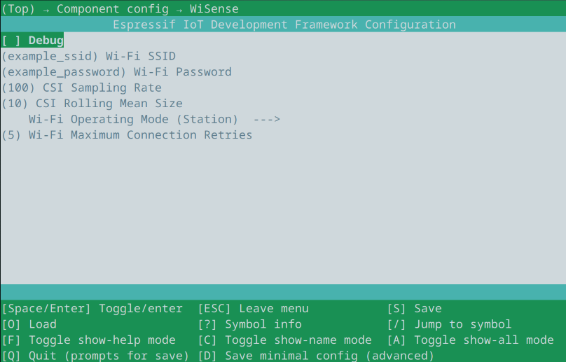

# esp-wisense Component

- [User Guide](../../README.md#third-module:-onboard-processing-using-the-esp32)

This project provides a examples on how to apply data processing into Wi-Fi CSI in real time.

The component structure is as follows:
```
esp-wisense/
├── examples/
│   ├── person-detection         // STA demo application for person detection
│   └── softAP                   // AP demo application
├── include/
│   ├── esp_wisense.h            // Header for data processing
│   ├── esp_wisense_connection.h // Header for Wi-Fi connection
│   └── model.h                  // TFLite model interface
├── private/
│   └── esp_wisense_internal.h   // Internal functions
├── src/
│   ├── esp_wisense.c            // Implementation for data processing
│   ├── esp_wisense_connection.c // Implementation for Wi-Fi connection
│   └── inference.cc             // TFLite model setup and inference
├── CMakeLists.txt               // Project-level configuration
├── Kconfig                      // Component configuration file
└── README.md                    // This documentation
```

## Adding as dependency

To add this component to an existing ESP-IDF project, first create a component manifest:
```
idf.py create-manifest
```

Then, add the following entry to the `dependencies` dictionary:
```
dependencies:
  ...
  esp-wisense:
    git: https://github.com/SamuelDucca/Wisensing-esp32.git
    path: OnboardProcessing/esp-wisense
    version: "main"
```

## Examples

- [Person Detection](./examples/person-detection/): Detection of person crossing over the STA-AP line-of-sight.
- [SoftAP](./examples/person-detection/): Access Point mode for ESP32.

## Config options

This component defines compile-time variables that alter its behaviour. To access them, run ```idf.py menuconfig``` and navigate to `Component config > WiSens` at the end of the list.



- Debug: Enable profiling prints;
- Wi-Fi SSID: Wi-Fi network identifier;
- Wi-Fi Password: Wi-Fi network PSK password;
- CSI Sampling Rate: CSI requests per second;
- CSI Rolling Mean Size: Rolling mean window slide;
- Wi-Fi Operating Mode: STA or AP.
  - Maximum Connections Retry (only STA)
  - Wi-Fi Channel (only AP)

## Profiling

The macros `PROFILE_START(id)` and `PROFILE_END(id)` enable to test the execution time of code chunks if the [Debug](#config-options) option is set.
```
PROFILE_START(dotprod);
  int32_t acc = 0;
  for (size_t i = 0; i < 100; i++) {
    acc += vec1[i] * vec2[i];
  }
PROFILE_END(dotprod);
```
Example output:
```
dotprod: cycles - 2720, time - 34us
```

The cycles refer to CPU clock cycles elapsed and time is measured in microseconds. The time is based on the cycle count and, therefore, is not reliable if the application enables CPU Dynamic Frequency Scaling (DFS), as the frequency is assumed constant and equal to that configured in the `menuconfig`.

Matching `PROFILE_START` and `PROFILE_END` must be at the same function scope, with `PROFILE_START` at an equal or higher scope to `PROFILE_END` to avoid undefined references.

The main CSI processing steps already have this macro.

